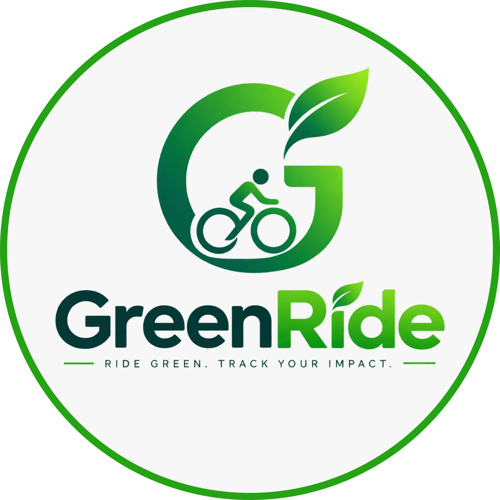

<h1>🌱 GreenRide</h1>

 

---

## 🌱 About GreenRide

**GreenRide** is a smart cycling and green mobility mobile application designed to encourage bicycle usage and promote sustainable transportation.

The application combines **GPS ride tracking, Green Index calculation, environmental impact tracking, cycling goals, achievements, and bicycle rental services** into one platform.

---

## ✨ Main Features

- ✅ **User Profile & Role-Based Access**
- ✅ **GPS Bicycle Ride Tracking**
- ✅ **Ride Purpose Classification**
- ✅ **Green Index & Environmental Impact**
- ✅ **Ride History & Cycling Statistics**
- ✅ **Green Goals, Streaks, Points & Achievements**
- ✅ **Interactive Cycling Map**
- ✅ **Bicycle Rental Providers & Listings**
- ✅ **Bicycle Reservation System**
- ✅ **Provider & Admin Management**

---

## 🌱 Green System

- ✅ **Green Index Calculation**
- ✅ **Estimated Environmental Impact**
- ✅ **Green Points & Achievements**
- ✅ **Cycling Goals & Progress Tracking**

---

## ☑️ Optional Features

`Green Leaderboards & Challenges` • `Rental Provider Ratings & Reviews` • `Push Notifications & Ride Reminders` • `AI Cycling Insights & Personalized Green Goals`

---

## 🛠️ Technology

  

**Flutter** • **Dart** • **laravel** • **mysql** • **microsoft azure**

**GPS / Location Services** • **Google Maps API**

---

## 🔮 Future Enhancements

`QR Bicycle Pickup & Return` • `Online Rental Payments` • `Live Bicycle Availability` • `Safer Cycling Route Recommendations` • `Cycling Infrastructure Reporting` • `Cycling Heatmaps` • `District-Level Green Dashboards` • `Wearable & Fitness Platform Integration` • `Corporate & University Green Challenges`

---

## 📂 Project Repositories

This project is organized into three repositories:

| Repository | Purpose |
|---|---|
| 📚 **greenride-documentation** | Project proposal, diagrams, requirements and documentation |
| 📱 **greenride-frontend** | GreenRide mobile application built with Flutter |
| ⚙️ **greenride-backend** | Backend services, database and application logic |

---

### 🌱 GreenRide

**Ride Green. Track Your Impact.**

